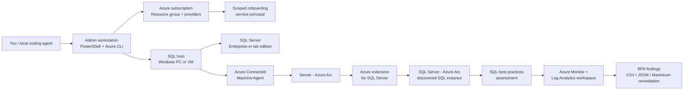

# Azure Arc SQL Server BPA lab kit

This repository gives you repeatable PowerShell scripts to install SQL Server Enterprise edition on a Windows 11 Pro-or-above PC, onboard it to Azure Arc for SQL Server, enable SQL best practices assessment (BPA), run BPA on demand and on a schedule, summarize findings, and generate remediation steps for high-priority findings.

## Beginner prompts for your local coding agent

If you are new to Azure Arc, SQL Server, or PowerShell, clone this repository locally and ask your coding agent to guide you one step at a time. Do not paste real passwords, product keys, tenant secrets, or service principal secrets into the chat. Use placeholders until you are ready to run the commands yourself in PowerShell.

Start with this prompt:

```text
I cloned this repository locally. Read the README and scripts, then walk me through using it on my Windows machine one step at a time. Ask me for only the values you need, use placeholders for secrets, and do not run any command that changes Azure, Windows, Hyper-V, SQL Server, or Arc until I confirm.
```

Then use the prompt that matches your goal:

| Goal | Prompt to give your agent |
|---|---|
| Check my laptop/workstation readiness | `Review this repo and tell me which prerequisites I need before running the Azure Arc SQL BPA lab. Then help me run scripts\00-Check-Prereqs.ps1 safely.` |
| Prepare Azure resources | `Help me prepare my Azure subscription for this lab using scripts\01-Prepare-AzureTenant.ps1. Explain each required parameter and wait for me to provide the subscription ID, location, and resource group name.` |
| Build a Hyper-V lab VM | `Help me create a local Hyper-V SQL host VM using scripts\05-Enable-HyperV.ps1 and scripts\06-New-HyperVSqlHost.ps1. First check what ISO path, VM name, memory, and disk size I should use.` |
| Install SQL Server for the lab | `Help me install SQL Server for this lab using scripts\07-Install-SqlServerEnterprise.ps1. Show me the exact command with placeholders for setup path, product key or evaluation mode, and SQL admin accounts.` |
| Onboard my SQL host to Azure Arc | `Help me onboard my SQL Server host to Azure Arc using scripts\08-Install-AzureArcForSql.ps1. Ask for the non-secret values first, then show me where to provide the service principal secret directly in PowerShell.` |
| Validate Arc SQL discovery | `Help me validate that my machine and SQL instance were discovered by Azure Arc using scripts\04-Validate-ArcSql.ps1. Explain what successful output should look like and what to check if SQL resources are missing.` |
| Enable and run SQL BPA | `Help me enable SQL best practices assessment with scripts\09-Enable-And-Run-SqlBestPracticesAssessment.ps1. Explain Log Analytics, the schedule fields, and how long results may take to appear.` |
| Summarize BPA results | `Help me summarize the latest SQL BPA findings using scripts\10-Summarize-SqlBestPracticesAssessment.ps1. Show me how to export CSV and JSON results locally without committing them to git.` |
| Get remediation guidance | `Help me generate high-priority remediation steps using scripts\11-Get-HighPriorityRemediationSteps.ps1, then explain the generated Markdown in beginner-friendly language.` |
| Clean up the lab | `Help me safely clean up this Azure Arc SQL lab. Start by explaining what azcmagent disconnect and az group delete will remove, then wait for my confirmation before running anything.` |

For safest results, ask your agent to show the command first, explain what it changes, and wait for your approval before running it.

## Table of contents

- [Beginner prompts for your local coding agent](#beginner-prompts-for-your-local-coding-agent)
- [Important design note](#important-design-note)
- [Lab topology](#lab-topology)
- [Files](#files)
- [What this lab builds](#what-this-lab-builds)
- [End-to-end flow](#end-to-end-flow)
- [Licensing values for the SQL extension](#licensing-values-for-the-sql-extension)
- [Common high-priority BPA fixes](#common-high-priority-bpa-fixes)
- [Publish to GitHub](#publish-to-github)
- [Customer replication checklist](#customer-replication-checklist)
- [Cleanup](#cleanup)

## Important design note

Azure Arc-enabled servers are meant for servers outside Azure, such as on-premises PCs/servers, VMware, Hyper-V, or another cloud. For a learning lab, a Windows 11 Pro/Enterprise/Education PC works. For production-like testing, use a Windows Server host or VM.

SQL Server Enterprise edition requires properly licensed Enterprise installation media or a valid product key. These scripts do not include SQL Server binaries, keys, credentials, or tenant-specific secrets.

## Lab topology

| Layer | Lab equivalent | Purpose |
|---|---|---|
| Customer tenant | Your test Entra tenant and Azure subscription | Validates tenant/subscription/provider/RBAC setup |
| Customer resource group | `rg-arc-sql-lab` | Holds Arc machine and SQL Server - Azure Arc resources |
| Customer SQL host | Windows 11 Pro-or-above PC or non-Azure Windows Server VM with SQL Server Enterprise | Target machine to onboard |
| Azure Arc agent | Azure Connected Machine Agent | Registers the machine as `Server - Azure Arc` |
| Azure SQL extension | `WindowsAgent.SqlServer` | Discovers local SQL instances and creates Arc SQL resources |

## Files

| File | Run from | What it does |
|---|---|---|
| `scripts\00-Check-Prereqs.ps1` | Admin workstation | Checks Azure CLI login, Azure CLI extensions, and provider registration state |
| `scripts\01-Prepare-AzureTenant.ps1` | Admin workstation | Registers resource providers, creates the lab resource group, and creates a scoped onboarding service principal |
| `scripts\02-Onboard-SqlHostToArc.ps1` | Target SQL host as Administrator | Installs the Connected Machine Agent and connects the host to Azure Arc |
| `scripts\03-Enable-ArcSqlExtension.ps1` | Admin workstation | Optional fallback to install the Azure extension for SQL Server if automatic SQL onboarding does not happen |
| `scripts\04-Validate-ArcSql.ps1` | Admin workstation | Lists Arc machine, extension, and AzureArcData resources for validation |
| `scripts\05-Enable-HyperV.ps1` | Local machine as Administrator | Enables Hyper-V and required management tools |
| `scripts\06-New-HyperVSqlHost.ps1` | Local machine as Administrator | Creates a Hyper-V VM for the SQL host from a Windows or Linux ISO |
| `scripts\07-Install-SqlServerEnterprise.ps1` | Target SQL host as Administrator | Installs SQL Server Enterprise from licensed media or evaluation media |
| `scripts\08-Install-AzureArcForSql.ps1` | Target SQL host as Administrator | Installs Azure Connected Machine Agent, connects the host to Azure Arc, and installs the Arc SQL extension |
| `scripts\09-Enable-And-Run-SqlBestPracticesAssessment.ps1` | Admin workstation | Creates/configures Log Analytics and Azure Monitor resources, enables BPA, sets the schedule, and optionally runs BPA immediately |
| `scripts\10-Summarize-SqlBestPracticesAssessment.ps1` | Admin workstation | Reads `SqlAssessment_CL` from Log Analytics and summarizes BPA findings |
| `scripts\11-Get-HighPriorityRemediationSteps.ps1` | Admin workstation | Generates Markdown remediation steps for failed high-severity BPA findings |
| `sql\Check-SqlArcPrereqs.sql` | SQL Server | Checks SQL database state and `NT AUTHORITY\SYSTEM` connectivity requirements |

## What this lab builds



The finished lab gives you an Arc-enabled SQL Server host, SQL discovery in Azure, BPA configured through Azure Monitor, and local exports that summarize findings and remediation steps.

## End-to-end flow

1. Create or use a test Azure tenant/subscription.
2. On your admin workstation, install Azure CLI and sign in:

   ```powershell
   az login
   az account set --subscription "<subscription-id>"
   ```

3. Prepare Azure-side resources:

   ```powershell
   cd ".\arc-sql-lab"
   .\scripts\00-Check-Prereqs.ps1 -SubscriptionId "<subscription-id>"
   .\scripts\01-Prepare-AzureTenant.ps1 -SubscriptionId "<subscription-id>" -Location "westus3"
   ```

   Save the service principal output securely. You will need `appId`, `password`, and `tenant`.

4. Install SQL Server Enterprise edition on the SQL host. Open PowerShell as Administrator on the target Windows 11 Pro-or-above PC and run:

   ```powershell
   .\scripts\07-Install-SqlServerEnterprise.ps1 `
     -SetupPath "D:\setup.exe" `
     -ProductKey "<enterprise-product-key>" `
     -SqlSysAdminAccounts "CONTOSO\SqlAdmins","$env:USERDOMAIN\$env:USERNAME"
   ```

   For a short-lived evaluation lab with evaluation media:

   ```powershell
   .\scripts\07-Install-SqlServerEnterprise.ps1 `
     -SetupPath "D:\setup.exe" `
     -UseEvaluation `
     -SqlSysAdminAccounts "$env:USERDOMAIN\$env:USERNAME"
   ```

5. Build the SQL host outside Azure if you need a VM instead of using the local PC:

   - Windows Server 2019/2022 VM in Hyper-V, VMware, or another cloud.
   - SQL Server 2017 or later. SQL Server Developer edition is fine for lab learning.
   - Internet egress to Azure Arc endpoints.
   - Local administrator access.

   To create the host on this machine with Hyper-V, first open PowerShell as Administrator. If Hyper-V is not enabled:

   ```powershell
   .\scripts\05-Enable-HyperV.ps1
   ```

   Restart if prompted, then create a Windows SQL host VM:

   ```powershell
   .\scripts\06-New-HyperVSqlHost.ps1 `
     -OsType Windows `
     -VmName "arcsql-win01" `
     -IsoPath "C:\ISO\WindowsServer2022.iso" `
     -MemoryStartupBytes 8GB `
     -VhdSizeBytes 120GB `
     -Start
   ```

   Or create a Linux SQL host VM:

   ```powershell
   .\scripts\06-New-HyperVSqlHost.ps1 `
     -OsType Linux `
     -VmName "arcsql-linux01" `
     -IsoPath "C:\ISO\ubuntu-22.04.5-live-server-amd64.iso" `
     -MemoryStartupBytes 8GB `
     -VhdSizeBytes 120GB `
     -Start
   ```

   For the best Azure Arc for SQL learning path, use Windows Server first. The Windows SQL extension path is generally the most representative for customer SQL Server estates.

6. On the SQL host, run SQL prerequisite checks using `sql\Check-SqlArcPrereqs.sql`.

7. On the SQL host, open an elevated PowerShell window and onboard the server:

   ```powershell
   .\scripts\08-Install-AzureArcForSql.ps1 `
     -SubscriptionId "<subscription-id>" `
     -ResourceGroupName "rg-arc-sql-lab" `
     -Location "westus3" `
     -TenantId "<tenant-id>" `
     -ServicePrincipalId "<app-id>" `
     -ServicePrincipalSecret "<password>" `
     -LicenseType "Paid"
   ```

8. Wait a few minutes, then validate from the admin workstation:

   ```powershell
   .\scripts\04-Validate-ArcSql.ps1 -SubscriptionId "<subscription-id>" -ResourceGroupName "rg-arc-sql-lab"
   ```

9. If the SQL extension was not installed automatically, run:

   ```powershell
   .\scripts\03-Enable-ArcSqlExtension.ps1 `
     -SubscriptionId "<subscription-id>" `
     -ResourceGroupName "rg-arc-sql-lab" `
     -MachineName "<arc-machine-name>" `
     -Location "westus3" `
     -LicenseType "PAYG"
   ```

10. Enable SQL best practices assessment, set a weekly schedule, and optionally run it immediately:

    ```powershell
    .\scripts\09-Enable-And-Run-SqlBestPracticesAssessment.ps1 `
      -SubscriptionId "<subscription-id>" `
      -ResourceGroupName "rg-arc-sql-lab" `
      -MachineName "<arc-machine-name>" `
      -Location "westus3" `
      -WorkspaceName "loganalyticsarc-bpa" `
      -ScheduleDayOfWeek "Sunday" `
      -ScheduleStartTime "00:30" `
      -RunNow
    ```

    The on-demand run usually completes in minutes, but results can take up to two hours to appear in Log Analytics.

11. Summarize the latest BPA findings:

    ```powershell
    .\scripts\10-Summarize-SqlBestPracticesAssessment.ps1 `
      -WorkspaceId "<log-analytics-workspace-customer-id>" `
      -LookbackHours 24 `
      -ExportCsvPath ".\bpa-results.csv" `
      -ExportJsonPath ".\bpa-results.json"
    ```

12. Generate high-priority remediation steps:

    ```powershell
    .\scripts\11-Get-HighPriorityRemediationSteps.ps1 `
      -WorkspaceId "<log-analytics-workspace-customer-id>" `
      -LookbackHours 24 `
      -OutputMarkdownPath ".\high-priority-remediation.md"
    ```

## Licensing values for the SQL extension

Use the value that matches the customer's intended configuration:

| Value | Meaning |
|---|---|
| `PAYG` | Pay-as-you-go SQL licensing through Azure |
| `Paid` | Existing SQL license with Software Assurance or subscription |
| `LicenseOnly` | Register inventory only; no paid management features |

For best practices assessment, use `PAYG` or `Paid`. `LicenseOnly` is inventory-oriented and does not support BPA.

## Common high-priority BPA fixes

| Finding | Typical remediation |
|---|---|
| SQL Server Agent stopped | Start and set `SQLSERVERAGENT` to automatic if jobs, maintenance, or alerts are expected |
| SQL Server Browser stopped | Enable only when named instances or dynamic ports require discovery |
| Max server memory too high | Set `max server memory (MB)` below physical RAM, leaving memory for Windows and agents |
| Backup compression disabled | Enable `backup compression default` |
| Instant File Initialization disabled | Grant the SQL Server service account `Perform volume maintenance tasks`, then restart SQL Server |
| TempDB initial size | Pre-size tempdb files and use consistent growth settings |
| NTFS block size not 64 KB | Move SQL files to a volume formatted with 64 KB allocation units |
| Deprecated features | Replace deprecated views, functions, data types, or syntax in app/database code |

## Publish to GitHub

After reviewing the scripts and removing any generated result files that might contain environment details:

```powershell
cd ".\arc-sql-lab"
git init
git add .
git commit -m "Add Azure Arc SQL BPA PowerShell lab kit"
git branch -M main
git remote add origin https://github.com/sushantsrv/arc-sql-bpa-lab.git
git push -u origin main
```

Create the empty repository first at `https://github.com/sushantsrv/arc-sql-bpa-lab`, or change the remote URL to your preferred repository name.

## Customer replication checklist

Use this list to make your lab closer to the customer environment:

| Customer attribute | What to mirror in lab |
|---|---|
| Tenant policy | Conditional Access, MFA, management groups, Azure Policy, allowed regions |
| RBAC | Same role model for onboarding operators and resource group owners |
| Network | Proxy, firewall, private endpoint policy, outbound allow-list |
| SQL estate | SQL version, edition, named/default instances, service account pattern |
| Security hardening | `NT AUTHORITY\SYSTEM` SQL login state, local admin model, endpoint protection |
| Tagging | Environment, owner, cost center, customer, workload |
| Governance | Azure Policy initiatives for Arc servers and AzureArcData resources |

## Cleanup

Disconnect the lab SQL host first if you no longer need it:

```powershell
azcmagent disconnect
```

Then delete the Azure lab resource group:

```powershell
az group delete --name "rg-arc-sql-lab" --yes
```
